# Figra


A powerful file analysis tool that parses import/export statements, generates dependency trees, and tracks filename references with alias resolution. Features automatic ripgrep binary download and multi-platform support.

> 🚧 **Note:** This tool is currently in development. Some features may not be fully implemented yet.

## ✨ Features

- **Auto Download** - Automatically downloads ripgrep binary for your platform
- **Dependency Trees** - Generates hierarchical file structures
- **File Correlation** - Maps relationships between files
- **Filename Tracking** - Finds filename mentions in code
- **Import/Export Analysis** - Parses all import/export relationships
- **Multi-Platform** - Supports Windows, macOS, and Linux
- **Smart Extraction** - Automatically extracts and sets up ripgrep

---

## 📦 Installation

```bash
npm install -g @neabytelab/figra
```

## 🚀 Usage

```bash
# Download and setup ripgrep binary (required first time)
figra download

# Analyze a file
figra /path/to/your/file.ts
```

## 📁 Supported Files

- `.js`, `.mjs`, `.cjs` - JavaScript files
- `.jsx` - React JavaScript
- `.ts` - TypeScript
- `.tsx` - React TypeScript

---

## 🔧 How Figra Works?

```mermaid
graph TD
    A[📁 Target File] --> B[🔧 Stage 1: Parser]
    B --> C[🔍 Extract Exports]
    C --> D[🔧 Stage 2: Finder]
    D --> E[⚡ Ripgrep Search]
    E --> F[🎯 Find Consumers]
    F --> G[🔧 Stage 3: Resolver]
    G --> H[🛣️ Resolve Paths]
    H --> I[🔧 Stage 4: Correlation]
    I --> J[🔗 Map Relationships]
    J --> K[📊 Dependency Tree]
    
    B --> B1[Functions]
    B --> B2[Classes]
    B --> B3[Interfaces]
    B --> B4[Types]
    B --> B5[Enums]
    
    D --> D1[Named Imports]
    D --> D2[Default Imports]
    D --> D3[Type Imports]
    D --> D4[CommonJS]
    
    G --> G1[Relative Paths]
    G --> G2[Alias Resolution]
    G --> G3[Absolute Paths]
    
    I --> I1[Direct Connections]
    I --> I2[Re-export Chains]
    
    classDef important fill:#e1f5fe,stroke:#01579b,stroke-width:3px,color:#000
    classDef stage fill:#f3e5f5,stroke:#4a148c,stroke-width:2px,color:#000
    classDef result fill:#e8f5e8,stroke:#1b5e20,stroke-width:2px,color:#000
    
    class B,D,G,I stage
    class C,E,F,H,J important
    class K result
```



### 🔍 **Stage 1: File Structure Parsing**
- **Parser Module** (`Parser.ts`) extracts all export declarations from the target file
- Detects **functions**, **classes**, **interfaces**, **enums**, **types**, **variables**, and **default exports**
- Supports **ES6**, **CommonJS**, **named exports**, **re-exports**, and **default exports**
- Uses regex patterns to identify different export patterns accurately

### 🔎 **Stage 2: Pattern-Based Search**
- **Finder Module** (`Finder.ts`) uses **ripgrep** to search across your entire project
- Generates comprehensive search patterns for different import styles:
  - `import { name } from 'path'` (named imports)
  - `import name from 'path'` (default imports)
  - `import type { name } from 'path'` (type imports)
  - `const { name } = require('path')` (CommonJS destructuring)
  - `const name = require('path')` (CommonJS default)
- Filters results by file extensions and ignores common directories (node_modules, dist, etc.)

### 🛣️ **Stage 3: Path Resolution**
- **Resolver Module** (`Resolver.ts`) resolves import paths to actual file locations
- Handles multiple path types:
  - **Relative paths** (`./`, `../`) with proper directory traversal
  - **Alias resolution** from `tsconfig.json` path mapping
  - **Absolute paths** and **cross-platform compatibility**
- Supports complex nested structures and wildcard aliases (`@utils/*`)

### 🔗 **Stage 4: Dependency Correlation**
- **Correlation Module** (`Correlation.ts`) maps relationships between files
- Identifies two types of connections:
  - **Direct**: Files that directly import from the analyzed file
  - **Re-export**: Files that re-export exports from the analyzed file
- Detects **re-export chains** and **alias-based re-exports**
- Returns structured **dependency trees** with connection details

---

## 🚧 TODO Checklist

#### Core Analysis Engine
- [x] **File Structure Parsing** - Extracts export declarations (functions, classes, interfaces, types, enums)
- [x] **Export Type Detection** - Supports ES6, CommonJS, default, named, and re-exports
- [x] **File Reference Tracking** - Uses ripgrep to find cross-file references
- [x] **Pattern-based Search** - Multiple search patterns for different import styles
- [x] **Project Root Detection** - Automatically finds project root directory

#### Cross-Platform Support
- [x] **Platform Detection** - macOS (x64/ARM64), Windows (x64/ARM64/i686), Linux (multiple architectures)
- [x] **Binary Management** - Downloads and manages ripgrep v14.1.1 automatically
- [x] **Archive Extraction** - Handles tar.gz (Unix) and zip (Windows) formats
- [x] **Progress Tracking** - Visual download progress with user feedback

#### File Support & Validation
- [x] **Multi-format Support** - `.js`, `.mjs`, `.cjs`, `.jsx`, `.ts`, `.tsx`
- [x] **File Validation** - Checks existence and extension validity
- [x] **Error Handling** - Comprehensive error messages and validation

#### CLI Interface
- [x] **Command Line Interface** - `figra <file-path>` and `figra download` commands
- [x] **Search Filtering** - Ignores common directories (node_modules, dist, .git, etc.)
- [x] **JSON Output** - Structured file analysis results
- [x] **Duplicate Filtering** - Removes duplicate search results

### Enhance Core Features
- [ ] Add configurable search patterns for better filtering
- [ ] Add real-time file watching with live updates
- [ ] Create API exports for programmatic usage
- [ ] Generate visual dependency tree diagrams
- [ ] Improve CLI progress indicators and user feedback

### Support Alias Resolution from Config Files
- [ ] Parse `astro.config.js/ts` for Astro aliases
- [ ] Parse `bun.config.js` for Bun aliases
- [ ] Parse `esbuild.config.js` for esbuild aliases
- [ ] Parse `jest.config.js` for Jest testing aliases
- [ ] Parse `jsconfig.json` for JavaScript path aliases
- [ ] Parse `metro.config.js` for React Native aliases
- [ ] Parse `next.config.js` for Next.js aliases
- [ ] Parse `nuxt.config.js/ts` for Nuxt.js aliases
- [ ] Parse `package.json` for npm/yarn/pnpm aliases
- [ ] Parse `parcel.config.js` for Parcel aliases
- [ ] Parse `rollup.config.js` for Rollup aliases
- [ ] Parse `svelte.config.js` for SvelteKit aliases
- [x] Parse `tsconfig.json` for TypeScript path aliases
- [ ] Parse `vite.config.js/ts` for Vite bundler aliases
- [ ] Parse `vitest.config.js/ts` for Vitest testing aliases
- [ ] Parse `webpack.config.js` for Webpack aliases

---

## 📄 License

This project is licensed under the MIT license. See the [LICENSE](LICENSE) file for more info.